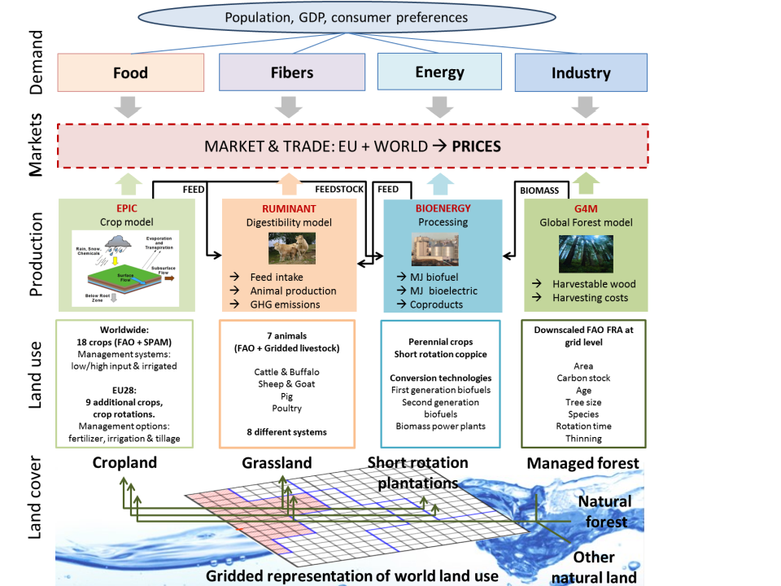

GLOBIOM
=======

.. image:: _images/logo.png
   :width: 154

This site provides documentation for the GLOBIOM model, links to GLOBIOM resources, and
helps you find your way in the model's GAMS code. GAMS script descriptions and dependency
links that match the Trunk version of the GLOBIOM model are provided.

About GLOBIOM
-------------
The `Global Biosphere Management Model <http://www.globiom.org>`_ (GLOBIOM) has been developed and used by the International Institute for Applied Systems Analysis (IIASA) since the late 2000s. The partial-equilibrium model represents main land use sectors, including agriculture and forestry. The supply side of the model is built-up from the bottom (spatially explicit land cover, land use, management systems and economic cost information) to the top (regional commodity markets). This detailed structure allows a rich set of environmental and socio-economic parameters to be taken into account.

The spatial resolution of the supply side relies on the concept of `Simulation Units <https://geo-bene.project-archive.iiasa.ac.at/files/Deliverables/Geo-BeneGlbDb10(DataDescription).pdf>`_, which are aggregates of 5 to 30 arcmin pixels belonging to the same altitude, slope, and soil class, and also the same country. For crops, livestock, and forest products, spatially explicit Leontief production functions covering alternative production systems are parameterized using biophysical models like `EPIC <https://iiasa.ac.at/web/home/research/researchPrograms/EcosystemsServicesandManagement/EPIC.en.html>`_ or `G4M <https://iiasa.ac.at/web/home/research/researchPrograms/EcosystemsServicesandManagement/G4M.en.html>`_. 

GLOBIOM covers major greenhouse gase (GHG) emissions from agriculture, forestry and other land uses based on IPCC accounting guidelines including N2O from the application of synthetic fertilizer and manure to soils, N2O from manure dropped on pastures, CH4 from rice cultivation, N2O and CH4 from manure management, and CH4 from enteric fermentation, and CO2 emissions/removals from above- and belowground biomass changes for other natural vegetation. CO2 emissions/removals from afforestation, deforestation, wood production in managed forests are estimated by geographically explicit (0.5x0.5 degree) model G4M that is connected with GLOBIOM. In addition, GLOBIOM endogenously represents mitigation technologies including technological and structural mitigation options. 

Commodity markets and international trade are modelled at the level of 37 aggregate economic regions where prices are endogenously determined at the regional level to establish market equilibrium. Trade is modelled following the spatial equilibrium approach (Takayama and Judge, 1971) based on cost competitiveness and homogenous good assumption which allows tracing of bilateral trade flows between individual regions. Besides primary products for the different sectors, the model has several final and by-products, for which the processing activities are defined. The model computes market equilibrium for agricultural and forest products by allocating land use among production activities to maximize the sum of producer and consumer surplus, subject to resource, technological, demand and policy constraints. GLOBIOM captures the multiple interrelationships between the different systems involved in provision of agricultural and forestry products, for example, population dynamics, changes in socio-economic and technological conditions, ecosystems and climate that lead to adjustments in the product mix and the use of land and other productive resources. The model is solved recursively dynamic and can provide projections up to 2100.

The model was initially developed for impact assessment of climate change mitigation policies in land-based sectors, including biofuels, and nowadays is also increasingly being implemented for agricultural and timber markets foresight, and economic impact analysis of climate change and adaptation, and a wide range of sustainable development goals.

The `model documentation <https://iiasa.github.io/GLOBIOM/GLOBIOM_Documentation_20180604.pdf>`_
provides a detailed description of the main features of the GLOBIOM model, as present in the
standard global version.

Model documentation
-------------------

Spatial resolution and land use representation
~~~~~~~~~~~~~~~~~~~~~~~~~~~~~~~~~~~~~~~~~~~~~~
The model includes six land cover types: cropland, grassland, short rotation plantations, managed forests, unmanaged forests, and other natural vegetation land. Managed forests refers to all forest areas where harvesting operations take place, while unmanaged forests refers to undisturbed or primary forests. There are other three land cover types represented in the model to cover the total land area: other agricultural land, wetlands, and not relevant (bare areas, water bodies, snow and ice, and artificial surfaces). These three categories are kept constant at their initial level and not modeled. Economic activities are associated with the first four land cover types. Depending on the profitability of primary, by-, and final products production activities, the model can switch from one land cover type to another. Land conversion over the simulation period is endogenously determined for each gridcell within the available land resources. Such conversion implies a conversion cost – increasing with the area of land converted - that is taken into account in the producer optimization behavior. Productivity of land for each type of crop is specific in GLOBIOM to the grid cell level, also for land not currently used as cropland. Therefore, it is possible to consider conversion of other land to cropland on the basis of the expected profitability associated to productivity and input costs in the new locations. A similar approach is used for grassland and grass productivity. This allows for direct calculation of the value of the marginal productivity of land in the model. This value is in the case of GLOBIOM the direct results of productivity estimates from EPIC.

Land conversion possibilities are further restricted through biophysical land suitability and production potentials, and through a matrix of potential land cover transitions. Land expansion in GLOBIOM is described at the level of each spatial unit. Land use change is considered at the local level, on a one to one hectare basis, through a conversion ruled by a matrix of land use conversion possibilities between land use types, and associated conversion costs. The land transition matrix offers the possibility to reflect land conversion patterns specific to a region, and to vary conversion costs depending on the land type to convert. 

Agriculture
~~~~~~~~~~

Crop production
^^^^^^^^^^^^^^^
GLOBIOM explicitly covers production of each of the 18 world major crops globally representing more than 70% of the total harvested area and 85% of the vegetal calorie supply as reported by FAOSTAT. Each crop can be produced under different management systems depending on their relative profitability: subsistence, low input rainfed, high input rainfed, and high input irrigated, when water resources are available. Crop yields are generated at the grid cell level on the basis of soil, slope, altitude and climate information, using the EPIC model. Within each management system, input structure is fixed following a Leontief production function. However, crop yields can change in reaction to external socio-economic drivers through switch to another management system or reallocation of the production to a more or less productive gridcell. Besides the endogenous mechanisms, an exogenous component representing long-term technological change is also considered.

Dedicated energy crops
^^^^^^^^^^^^^^^^^^^^^^
GLOBIOM explicitly covers biomass feedstocks from energy plantations and existing forests for energy use. Energy plantations are represented through short rotation tree plantations (SRP) of poplar, willow, or eucalyptus with rotation periods of up to 10 years. Productivities are based on NPP maps (Cramer et al., 1999) and the potential for plantation area expansion is determined by land suitability criteria based on aridity, temperature, elevation, population, and land-cover data. 

Livestock production
^^^^^^^^^^^^^^^^^^^^
The GLOBIOM model also incorporates a particularly detailed representation of the global livestock sector. With respect to animal species, distinction is made between dairy and other bovines, dairy and other sheep and goats, laying hens and broilers, and pigs. Livestock production activities are defined in several alternative production systems adapted from Seré and Steinfeld (1996): for ruminants, grass based (arid, humid, temperate/highlands), mixed crop-livestock (arid, humid, temperate/ highlands), and other; for monogastrics, smallholders and industrial. For each species, production system, and region, a set of input-output parameters is calculated based on the approach in Herrero et al. (2008).

Feed rations in GLOBIOM are defined with a digestion model (`RUMINANT <https://research.csiro.au/livegaps/tools/ruminant/>`_) consisting of grass, stovers, feed crops aggregates, and other feedstuffs. Outputs include four meat types, milk, and eggs, and environmental factors (manure production, N-excretion, and GHG emissions). The initial distribution of the production systems is based on Robinson et al. (2011). Switches between production systems allow for feedstuff substitution and for intensification or extensification of livestock production. The representation of the grass feed intake is an important component of the system representation as grassland productivity is explicitly represented in the model. Therefore, the model can represent a full interdependency between grassland and livestock. A detailed description of the livestock sector representation is also provided `here <https://doi.org/10.1073/pnas.1308044111>`_.

Forestry
~~~~~~~~

Biomass supply
^^^^^^^^^^^^^^
Total forest area in GLOBIOM is calibrated according to FAO Global Forest Resources Assessments (FRA) and divided into managed and unmanaged forest utilizing a downscaling routine based on human activity impact on the forest areas (Kindermann et al., 2008). The available woody biomass resources are provided by G4M for each forest area unit, and are presented by mean annual increments. Mean annual increments for forests are then in GLOBIOM divided into commercial roundwood, non-commercial roundwood and harvest losses, thereby covering the main sources of woody biomass supply. Commercial roundwood is stemwood that is suitable for industrial roundwood (sawlogs, pulplogs and other industrial roundwood). Harvest losses and non-commercial roundwood are stemwood that is unsuitable for industrial roundwood. The difference between harvest losses and non-commercial roundwood is that the former has unwanted stemwood sizes, while the latter has unwanted wood characteristics. The amount of harvest losses is based on G4M estimates while the share of non-commercial species is based on FRA (2010) data on commercial and non-commercial growing stocks. In addition to stemwood, available woody biomass resources also include branches and stumps; however, environmental and sustainability considerations constraint their availability and use for energy purposes.

Woody biomass production costs in GLOBIOM cover both harvest and transportation costs. Harvest costs for forests are based on the G4M model by the use of spatially explicit constant unit costs that include planting, logging, and chipping in the case of logging residues. Harvest costs also vary depending on geographical considerations such as the region and the steepness of terrain. Transport costs are on the other hand not spatially explicit but are modeled by using regional level constant elasticity transport cost functions, which approximate the short run availability of woody biomass in each region. These transport costs functions are then shifted over time in response to the changes in the harvested volumes and related investments in infrastructures. 

Forest industries
^^^^^^^^^^^^^^^^^
The forest sector is modeled to have seven final products (chemical pulp, mechanical pulp, sawnwood, plywood, fiberboard, other industrial roundwood, and household fuelwood). Demand for the various final products is modeled using regional level constant elasticity demand functions. Forest industrial products (chemical pulp, mechanical pulp, sawnwood, plywood and fiberboard) are produced by Leontief production technologies, which input-output coefficients are based on the engineering literature (e.g. FAO 2010). By-products of these technologies (bark, black liquor, sawdust, and sawchips) can be used for energy production or as raw material for pulp and fiberboard. Initial production capacities for forest industry final products are based on production quantities from `FAOSTAT <http://www.fao.org/faostat/en/#data>`_. After the base year the capacities evolve according to investment dynamics, which depend on depreciation rate and investment costs. 

GLOBIOM has detailed representation of the forest sector and its supply chains. The model includes five primary wood products (pulplogs, sawlogs, other industrial roundwood, fuelwood, and logging residues) that can be used as input for material or energy production processes. The current version of the model includes eight final products (sawnwood, plywood, fiberboard, chemical pulp, mechanical pulp, other industrial roundwood, fuelwood, and energy wood) and five byproducts (sawdust, woodchips, bark, black liquor, and recycled wood). Biomass for bioenergy can be sourced from pulplogs, fuelwood, logging residues or forest industry by-products. Detailed information on the forest sector representation is provided `here <https://doi.org/10.1016/j.forpol.2017.07.005>`_.

Link to G4M
^^^^^^^^^^^

For more detailed representation of forest mangaement sytsems and carbon carbon dynamics, GLOBIOM can be linked to the Global Forest Model (G4M) developed by IIASA which estimates the impact of forestry activities (afforestation, deforestation, and forest management) on biomass and carbon stocks. G4M cacluates afforestation and deforestation decisions are calculated by comparing net present values of agriculture and forestry land uses. Afforestation occurs where it is more profitable than the agriculture and the environmental conditions are suitable for forest growth. Deforestation, in contrast, happens where agriculture net present value plus profit from one-time selling of deforested wood exceeds the net present value of forestry. The net present values are estimated considering agriculture land rents and wood prices obtained from GLOBIOM and price of carbon stored in biomass. The land transitions in G4M are harmonized with GLOBIOM agriculture land demand. G4M simulates forest management aimed at sustainable production of wood demanded by GLOBIOM on regional scale. The main forest management options considered by G4M are variation of thinning, harvest intensity and forest residue collection. The harvest intensity is modelled through defining whether forest is used for intensive wood production (further is called managed) or not (further called unmanaged), and for the intensively used forest the harvest is determined by the choice of rotation length. The rotation length can be individually chosen but the model can estimate optimal rotation lengths to maximize increment, stocking biomass or harvestable biomass. 

Greenhouse gases
~~~~~~~~~~~~~~~~
GLOBIOM represents a comprehensive set of GHG mitigation options for the AFOLU sector. Structural mitigation options for agriculture are considered in GLOBIOM via different management systems. In the crop sector, four different crop management systems are differentiated using the EPIC model. In the livestock sector, also various production systems and livestock species are parameterized (Herrero et al., 2013). The detailed representation of production systems allows the model to explicitly represent structural changes in the agricultural sector under a climate policy. Farmers can switch to more GHG efficient management practices on site, reallocate production to more productive areas within a region, or through international trade across regions. 

In addition, technological options such as anaerobic digesters, animal feed supplements etc. are based on the `EPA mitigation option database <https://www.epa.gov/global-mitigation-non-co2-greenhouse-gases>`_. Emission reduction potentials (% emission savings), costs (annual costs i.e. direct costs and labour costs, change in input costs, and investment costs i.e. for anaerobic digesters), and potential impacts on productivities (% increase/decrease) were taken from the EPA mitigation options database. Relative emission savings and productivity changes were then applied to the different management systems in the GLOBIOM model to calculate absolute changes in GHG emissions and product output. Mitigation options (characterized by GHG reduction, productivity changes, and economic costs) are implemented in the model as additional management activities which can be applied on top of a production system. Mitigation options are adopted if the economic benefit i.e. through avoided carbon tax payments, potential productivity changes, exceed the cost of an option. More detailed information on parameterization of the marginal abatement cost curve for agriculture in GLOBIOM is provided `here <https://doi.org/10.1038/s41467-018-03489-1>`_.

G4M considers the following mitigation options for the forestry sector: reduction of deforestation area, increase of afforestation area, change of rotation length of existing managed forests in different locations, change of the ratio of thinning versus final fellings, change of harvest intensity (amount of biomass extracted in thinning and final felling activity), and change of harvest locations. These activities are not adopted independently by the forest owner since the model manages forest land dynamically and activities affect each other. The model is calculating the economic optimal combination of measures and the introduction of a GHG price gives an additional value to the forest through the carbon stored and accumulated in it which tends to decrease deforestation and increase afforestation. This might not happen at the same intensity though since less deforestation increases land scarcity and might therefore decrease afforestation. The existing forest under a GHG price is managed with longer rotations and expanding harvest to less productive forest. Where possible the model increases the area of forests used for wood production, meaning a relatively larger area is managed relatively less intensively which affects the carbon balance. Forest management activities can also have a feedback on emissions from deforestation because they might increase or decrease the average biomass in forests being deforested and influence biomass accumulation in newly planted forests depending on whether these forests are used for production or not. Market feedbacks and effects of these mitigation options e.g. prolonging rotation are explicitly accounted for as the production of wood to satisfy wood demand has higher priority than the carbon accumulation. In fact, much of the mitigation effects are achieved by structural and geographic relocation of harvesting schedules to increase sequestration while at the same time satisfy market demands. 

The estimated AFOLU mitigation potentials include N2O from the application of synthetic fertilizer, manure to soils and dropped on pastures, and from manure management, CH4 from rice cultivation, enteric fermentation, and manure management, CO2 emissions from above- and belowground biomass changes and dead organic matter related to land use changes and forest management as well as soil carbon emissions from deforestation/afforestation. Remaining soil carbon emissions/removals (aside following afforestation/deforestation) as well as mitigation potentials from wetlands are not considered in this study.

Model code
----------
See the :doc:`source_tree` to learn how the GLOBIOM code is structured, and what the various
code files do. 

An Open Source version of GLOBIOM is under preparation. External collaborators are given access
to a pre-release version of GLOBIOM hosted on GitHub in
`this repository <https://github.com/iiasa/GLOBIOM_Prerelease_Model>`_.

Development
-----------
The `GLOBIOM wiki <https://github.com/iiasa/GLOBIOM/wiki>`_ provides background and guidelines
for GLOBIOM development with an IIASA-specific focus. The GitHub `issue tracker
<https://github.com/iiasa/GLOBIOM/issues>`_ and `project boards
<https://github.com/iiasa/GLOBIOM/projects>`_ support collaborative development for team
members. These links work if you are signed in to GitHub and are a member of the
``iiasa/GLOBIOM`` GitHub team, or have been given collaborator access.
