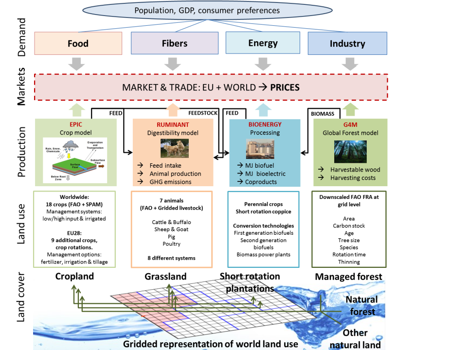

.. _introduction:

Introduction
============
The `Global Biosphere Management Model <http://www.globiom.org>`_ (GLOBIOM) has been developed and used by the International Institute for Applied Systems Analysis (IIASA) since the late 2000s. The partial-equilibrium model represents main land use sectors, including agriculture and forestry. The supply side of the model is built-up from the bottom (spatially explicit land cover, land use, management systems and economic cost information) to the top (regional commodity markets). This detailed structure allows a rich set of environmental and socio-economic parameters to be taken into account.

The spatial resolution of the supply side relies on the concept of `Simulation Units <https://geo-bene.project-archive.iiasa.ac.at/files/Deliverables/Geo-BeneGlbDb10(DataDescription).pdf>`_, which are aggregates of 5 to 30 arcmin pixels belonging to the same altitude, slope, and soil class, and also the same country. For crops, livestock, and forest products, spatially explicit Leontief production functions covering alternative production systems are parameterized using biophysical models like `EPIC <https://iiasa.ac.at/web/home/research/researchPrograms/EcosystemsServicesandManagement/EPIC.en.html>`_ or `G4M <https://iiasa.ac.at/web/home/research/researchPrograms/EcosystemsServicesandManagement/G4M.en.html>`_. Based on the structure of the global model, different regional model versions have been developed. Such versions focus on a specific region and incorporate more regional details, and possibly rely on a higher spatial resolution.

GLOBIOM covers major greenhouse gase (GHG) emissions from Agriculture, Forestry and Other Land Use (AFOLU) based on IPCC accounting guidelines including N2O from the application of synthetic fertilizer and manure to soils, N2O from manure dropped on pastures, CH4 from rice cultivation, N2O and CH4 from manure management, and CH4 from enteric fermentation, and CO2 emissions/removals from above- and belowground biomass changes for other natural vegetation. CO2 emissions/removals from afforestation, deforestation, wood production in managed forests are estimated by geographically explicit (0.5x0.5 degree) model G4M that is connected with GLOBIOM. In addition, GLOBIOM endogenously represents mitigation technologies including technological and structural mitigation options. 

Commodity markets and international trade are modelled at the level of 37 aggregate economic regions where prices are endogenously determined at the regional level to establish market equilibrium. The number of aggregate regions is generally flexible and can be adjusted. Trade is modelled following the spatial equilibrium approach based on cost competitiveness and homogenous good assumption which allows tracing of bilateral trade flows between individual regions. Besides primary products for the different sectors, the model has several final and by-products, for which the processing activities are defined. The model computes market equilibrium for agricultural and forest products by allocating land use among production activities to maximize the sum of producer and consumer surplus, subject to resource, technological, demand and policy constraints. GLOBIOM captures the multiple interrelationships between the different systems involved in provision of agricultural and forestry products, for example, population dynamics, changes in socio-economic and technological conditions, ecosystems and climate that lead to adjustments in the product mix and the use of land and other productive resources. The model is solved recursively dynamic and can provide projections up to 2100.

The model was initially developed for impact assessment of climate change mitigation policies in land-based sectors, including biofuels, and nowadays is also increasingly being implemented for agricultural and timber markets foresight, and economic impact analysis of climate change and adaptation, and a wide range of sustainable development goals.
